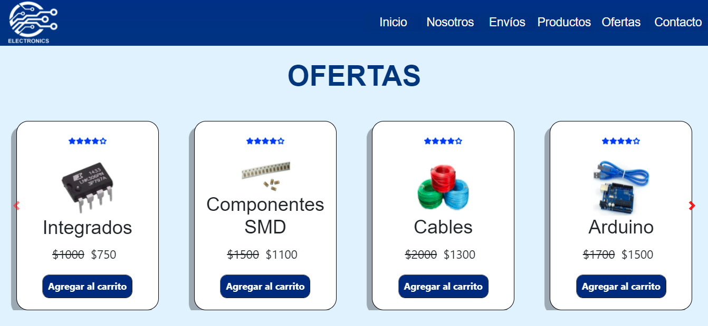

# Electronics  🚀

Electronics es una tienda ecommerce que distribuye componentes electrónicos a toda la Argentina. 
Es el nexo entre los fabricantes ubicados en el exterior y los clientes. Se pueden registrar en el sitio para investigar los beneficios y ofertas.

## Construido con 🛠️

* [HTML](https://www.w3.org/) - Lenguaje de etiquetas
* [CSS](https://www.w3.org/) - Hojas de estilos
* [JS](https://www.w3.org/) - Lenguaje de programación
* [NODE](https://nodejs.org/es/) - Entorno de ejecución
* [BOOTSTRAP](https://getbootstrap.com/) - Framework CSS
* [SASS](https://sass-lang.com/) - Procesador CSS
* [GIT](https://git-scm.com/) - Sistema de control de versiones
* [GITHUB](https://github.com/) - Repositorio online

## Preview 👁️‍🗨️

## Demo 💻

Para visualizar la demo del proyecto se podrá acceder con el siguiente [link](https://ruizyamil.github.io/electronics)

## Autores ✒️

- [@RuizYamil](https://www.github.com/RuizYamil)